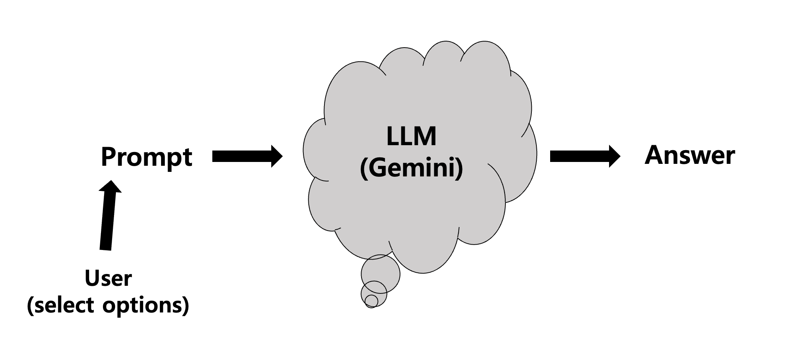

# Langchain_Gemini_Email
### Before Get Started...
My first langchain code is uploaded [here](https://github.com/Skkuhodomo/Chat-GPT-Anecdote-Maker)🦜🔗
## Flow



## An Email Adviser Using Gemini-Pro. 
When the user enters an email, the system generates the desired email based on the entered prompt, adjusting the tone and content according to the context.


Download Source code 
```
  git clone https://github.com/Skkuhodomo/Langchain_Gemini_email.git
```
</pre>

Install library
```
  pip install -r requirements.txt
```
Run
```
  streamlit run Langchain_web_app/main.py
```
Example:

### Discussion
I used "lambda". But I think it is not necessary to use 'lambda' when we use GPT. 
I got a lot of errors,,After that finanlly I made my Gemini email adviser with using 'lamdba'.
